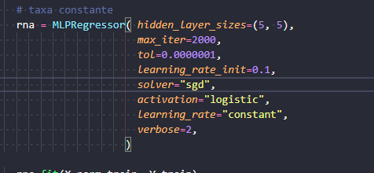
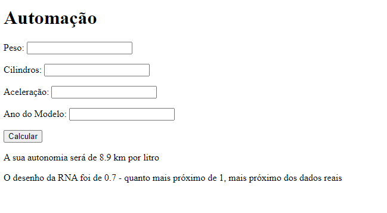
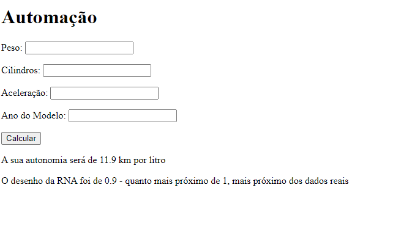

Trabalho de Implementação da Disciplina INC
# Equipe: Ruan Felipe

# Problema: Cálculo de consumo de um veículo qualquer.
O usuário informará o peso, ano do modelo, número de cilindradas e aceleração do carro e receberá o valor do seu consumo nesse momento.

# Dataset:
Nome: Auto-Mpg Data
Link: https://www.kaggle.com/uciml/autompg-dataset?select=auto-mpg.csv

- Nem todos os dados do dataset foram relevantes para o calculo de consumo. Deslocamento, origem e nome do carro não tinham relevância.

# Técnica:
Rede Neural - Perceptron de Múltiplas Camadas (MLP).

A perceptron multicamadas (MLP) é uma rede neural semelhante à perceptron, mas com mais de uma camada de neurônios em alimentação direta. Tal tipo de rede é composta por camadas de neurônios ligadas entre si por sinapses com pesos. O aprendizado nesse tipo de rede é geralmente feito através do algoritmo de retro-propagação do erro

Os valores de entrada da rede serão o peso do automóvel, quantos cilindros ele possui, a aceleração a que se deseja tirar a dúvida e o ano do modelo do carro. Essas entradas produzirão uma saída que será o valor de consumo do carro em km/l.

Os resultados mostram um bom desempenho da MLP na identificação de elementos não lineares, e garantem uma significativa redução do erro do valor predito na saída. O seu desempenho foi medido pela taxa ao qual ela se aproxima dos dados reais do dataset, quanto mais próximo de 1, melhor. Essa taxa é calculada pela função r2_score fornecido pela biblioteca sklearn do python, utilizando dados de testes e dados previstos.

Os parâmetros iniciais foram:

5 neurônios da primeira camada
5 neurônios na segunda camada
2000 mil épocas

A taxa de desempenho ficou em 7.

Depois foram alterados para:

10 neurônios da primeira camada
5 neurônios na segunda camada
4000 mil épocas

A taxa de desempenho subiu para 9.

Foram rodadas 4000 épocas com uma taxa de aprendizado de 0.1. Para a atualização dos parametros estou usando a estratégia da descida do gradiente estocástico. Por fim, foi utilizada a função de ativação logística.

Essas estratégias e parâmetros descritos acima foram sendo testados e alterados manualmente até que os valores de saída tivessem uma taxa de desempenho superior a 8.
